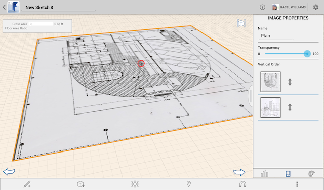

# Import and Modify Ground Overlay Images

----

Acquire images for your design canvas and alter them if desired.

## Importing Ground Overlay Images

1. To import an image, select the Import button from the bottom toolbar.

1. Select an image from your Camera Roll or Photo Stream

Your image will be automatically imported into the canvas.

## Modify Ground Overlay Images

1. Use the palette on the right-side of the screen to modify image properties.
2. From the palette, you can edit the image's name and transparency.
3. Drag and Drop using the Vertical Order panel to organize the placement (order) of all the ground overlay images, including any imported satellite imagery. 
    
    
