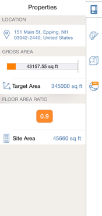

# Building Performance

----

Start a BIM workflow by evaluating the performance of elements from the beginning of the design process.

### Building Performance

| | |
| ---- | ---- |
| Properties provides information about a chosen object. The values update as you make changes. Use the Solar and Energy Analysis features (Pro only) to determine how the building will perform.   |      |

#### See Also

* Examine Object Properties
* [Levels and Volume ](GUID-DAB84CAC-0628-4194-98F5-9F0F70FAE9CB.htm)

  

#### Topics in this section

* [ Sun and Shadow Settings ](GUID-433A199B-97FC-4023-9B50-3C9205E6E8E2.htm)
    
    Control the angle of the shadows at your locations by setting date and time.
* [Solar Analysis](GUID-7DEF3021-B975-4586-AFF0-F08E997E8F35.htm)
    
    Visualize the amount of solar radiation that your model receives.
* [Whole Building Energy Analysis](GUID-7A09DABC-0D9C-48E5-BEBD-E950C786324A.htm)
    
    Evaluate factors that affect building performance, such a wall insulation and HVAC efficiency.

[Please send us your comment about this page](#)