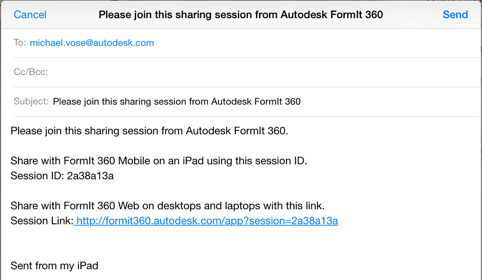

# Joining a Session

----

Become part of a collaboration.
 

* Login to [Autodesk 360](https://360.autodesk.com).
* Tap the link provided to you by the session host, or paste the link URL into your Web browser address bar. 
    
    
* Copy and paste the session ID into the Join Collaboration box. 
    
    
    
    You will be added as a collaborator and your icon will appear on the toolbar. Tap the red camera icon next to a collaborator's name to follow that person's session camera.
* When you are done collaborating, just Tap Leave Sharing Session.

Please note if you leave a session as a guest collaborator, a copy of the sketch will NOT be saved to your A360 account.
