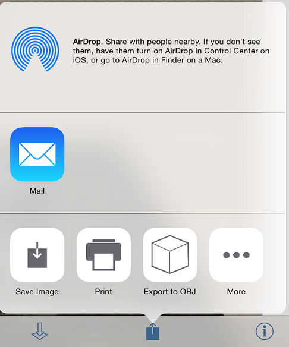

# Collaboration

----

Work simultaneously with others on the same sketch, or share your work later.
NoteYou will need a free [Autodesk 360](https://360.autodesk.com) account to use collaboration features.
* Use the Collaboration palette to start and manage sharing sessions. 
    
    
* You can start a collaboration session and let others see your design and see any edits you make. 
    
    

In addition to simultaneous collaboration through shared sessions, you can share the work you have created in various other ways. From emailing images of your design, to exporting your sketches so that they can be used in other programs, you can easily let others review your work. 
* Sharing options can be accessed from the Action toolbar by tapping on the Export icon. You can share your work through: 
    
    

* Export/Save to OBJ: If you want to open your work in another program, export an OBJ that will automatically be saved in your Autodesk 360 FormIt 360 folder as a ZIP file.
* Email: Select the Mail option, and you can email a snapshot of your current state of work through your chosen email provider.
* AirDrop: Use AirDrop via WiFi or Bluetooth to share the AXM file of your work with other nearby devices.
* Print: Use the print option to send a snapshot of your work to a nearby AirPrint printer.

#### See Also

* [Saving Your Work ](../../Manage Your Data/Saving Your Work.md)

  

#### Topics in this section

* [Start and Stop Collaborative Sessions](../Start and Stop Collaborative Sessions.md)
    
    Invite other people to work on the same design project.
* [Joining a Session](../Joining a Session.md)
    
    Become part of a collaboration.
* [Chat with Collaborators ](../Chat with Collaborators.md)
    
    Engage in dialog as you design.

