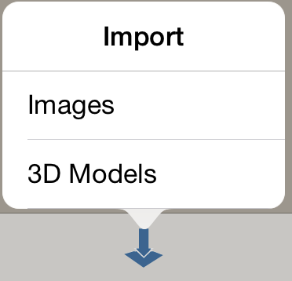

# Import 3D Models and Images

----

Add overlays and images to your designs for a variety of purposes.
 

Ground overlays add additional information to your sketch or provide a schematic to trace over.

1. Select an image or 3D model from your local or A360 storage area.

You will have the option to scale and crop your image. Your image will then be imported into the canvas.

1. Use the palette on the right-side of the screen to modify image properties.

Edit the image's name and transparency, if needed. Manage the vertical ordering of various ground overlays including the satellite image.

