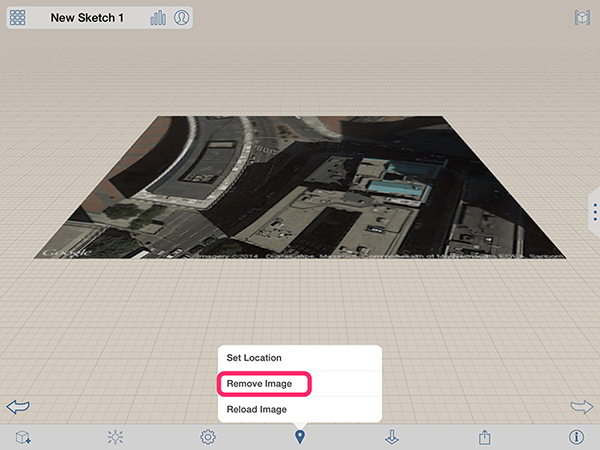

# Edit, Reload, or Remove a Satellite Image

----

Make changes to your location images.

## Working with Satellite Images

1. To reload a satellite image, select the location icon from the Action toolbar  and then choose Reload Image. 
2. To remove a satellite image:  
    * From the Action bar: Select the location icon from the bottom toolbar and choose Remove Image. option.
    * From the Context menu: Double tap to select the satellite image. Next, use a long-press motion over the image to bring up the context menu. 
    * Choose the delete icon.
3. Similar to other images, you can edit the name, transparency, and vertical order of satellite images. 
    
    
