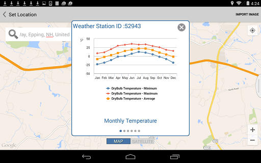

# Satellite Image Import

----

Add detail and realism to your design.
 

Satellite images and weather station data add important information to your designs.

#### Import Satellite Image

1. Tap the Set Location icon.
2. Use the search box below the Location symbol in the upper left to type in a specific location, or use the map view to pan and zoom to set a location.
3. Long press to place the red pin after you have found your location.

(See Weather Stations below to see climate data about your location.)

1. Tap Import Satellite Image to add the aerial photo to your sketch.
2. Use the dialog that appears to size the satellite image to show the relevant context for your sketch.
3. Tap Finish Importing.

#### Weather Stations

1. Tap a Weather Station icon near your selected location.

1. Use the displayed graphs of historical information about the temperature and wind direction for that location to help you make informed decisions about building orientation and massing given your project's unique climate.
2. Tap the X in the upper right corner to dismiss the weather station display.

