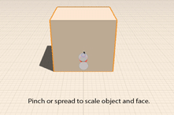
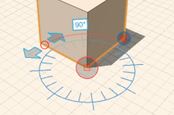

# Modify: Scale and Rotate

----

Adjust the size and orientation of objects.

1. To scale edges, faces or objects, first select, tap and hold to access the context menu, then choose the scale icon. Use a pinching motion to scale the geometry up or down.
2. To rotate edges, faces, and objects, select and long-press to access the rotate tool from the context menu. Tap to specify an axis of rotation. Drag the arrows specify start and end of the rotation angle.
