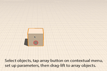

# Modify: Tilt, Array, Copy/Paste

----

Create more complex designs by making alterations to previously drawn shapes.

## Modify Geometry

To create more complex designs after sketching a shape or placing a primitive, you can use several contextual tools to modify your geometry. These operations include: Tilt, Facet (Web-only), Copy/Paste, and Array.

1. To tilt a face, select a face, and long press to see the context menu. Then choose the tilt icon from the context menu. Next, define the tilt axis by drawing a line. Then, tap a third point to start the tilt operation.
2. To copy and paste faces, edges, or objects, first select then choose the copy icon from the context menu. Then, bring up the context menu again to paste. When pasting you will have snap and inference options. Make a quick copy by dragging an object using a two-finger drag.
3. To array edges, faces, or entire objects, click on the array icon from the context menu. Next, specify the array parameters. Then, similar to the move tool - tap the object to start an array, and tap again to place arrayed elements.
