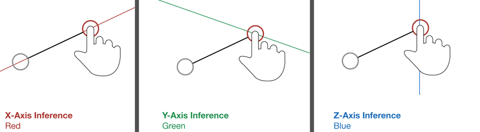
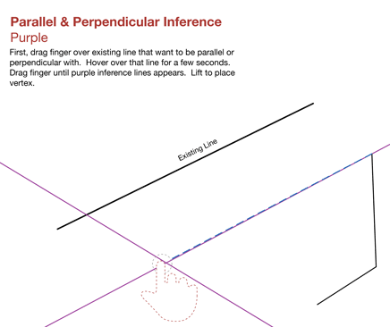
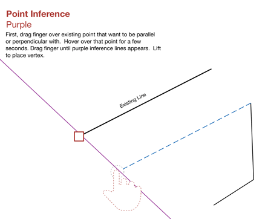

# Snaps and Inferences

----

Use these built-in capabilities to create more accurate designs.
 
* To make sketching and modeling easier, use snaps and inference points to accurately create, place, and edit geometry. You can use whatever axis you choose as the axis on which to draw or execute another action, such as extruding a surface. 
    
    

* You can toggle on/off the Snap to Grid feature.

*Snapping*

There are several snaps that can aid you while you are sketching and modeling. Snapping to objects is automatically enabled, and you can snap to:

* On Edge
* On Midpoint
* Endpoints (On vertex)
* On Face
* Center of Face
* On Ground Plane

To snap to the grid, you must enable the Snap to Grid toggle from the Settings menu.

*Inference Points*

Automatic selection of inference points is always enabled and will help you constrain the movement of geometry.

* You can move geometry along the X, Y, or Z axis. The X-axis inference is red, the Y-axis is green, and the Z-axis is blue. 
    
    
* You can also move geometry parallel or perpendicular to existing elements. Parallel and perpendicular inferences are purple. 
    
    
* Extending from a point: You can also use inferences to extend from a point reference. 
    
    

Extending from a point: You can also use inferences to extend from a point reference. Hover the mouse over a point you want to use as a reference until the tooltip appears, then use the inference axis that extends from the point.
