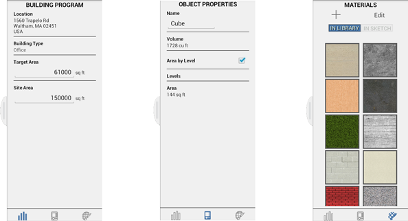

# Context Menu and Palette

----

Locate the tools to create and place designs.
 

## Contextual Menu

* Press and hold over an object to bring up the context menu. 
    
    
* The menu of tools will change according to the face, edge, or other object you have chosen. 
    
    

### Object/Materials Palette

* The palette on the right side of the screen accesses the Building Program, Properties, and Materials tabs.
