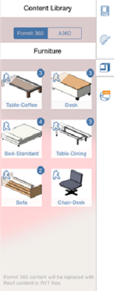

# Context Menu and Palette

----

Locate the tools to create and place designs.
 

The software's user interface makes use of a particular platform's standard interaction model.

## Contextual Menu

* To bring up the contextual menu, Long-press over an object or empty space. Depending on the selection, different tools will appear on the contextual menu that will let you edit the selection.

### Object/Materials Palette

* Tap on the palette handle or swipe from the edge to reveal the Object/Material Palette. You can use the Object Properties Tab to manage an object's name, define level settings, and receive feedback about area and volume. 
    
    
* Or, you can use the Materials Tab to create, edit, and apply materials to objects. 
    
    
* Use the Content Library to link a Library from your local computer, or from A360 Drive. Then you can drag and drop content from the library into your FormIt 360 sketch. 
    
    
