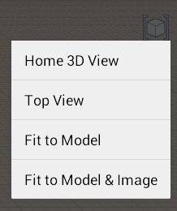

# User Interface tools

----

Reference for command interaction tools.

* With the View Settings menu, you can choose from a selection of preset views. These views will allow you to quickly visualize your model from different perspectives and zoom levels.
* The action bar is found on the bottom of your screen. The tools in the action bar will help you create, edit, and share content.

## The Action Bar

* Sketch Tools: Click to bring up a menu of creation tools that will help you draw shapes.
* Primitives: Click to bring up a menu of basic 3D shapes that you can place in your scene
* Change the Lighting and Shadows: Use this tool to change the date and time of day.
* Set the Location: Search for a location and import satellite imagery into your sketch. For more information on setting the location of your sketch.
* Snaps: Toggle on/off snapping to the grid.
* Share Your Work: Import images or save and email images.
