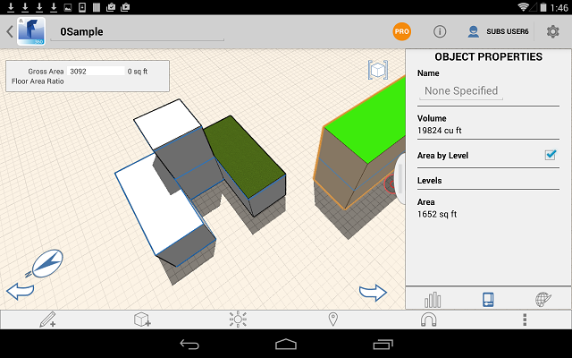

# Apply Levels and Materials to a Group

----

A way to affect many objects at once.
 

## Apply Levels
NoteLevels cannot be applied in Edit Group mode.
1. Select an object from the group, but do not enter edit mode.
2. Open the Object Properties palette.
3. With Area by Level turned on, select Levels to set the height value for each level. 
    
    

## Apply a Material

1. Select a group and double tap to display the Context Menu and tap Edit.
2. Choose objects of faces in the group.
3. Open the right side palette and view the Materials tab.
4. Tap Materials to and use a material from the library or one already selected for the group, if any. 
    
    
5. Tap Done.
