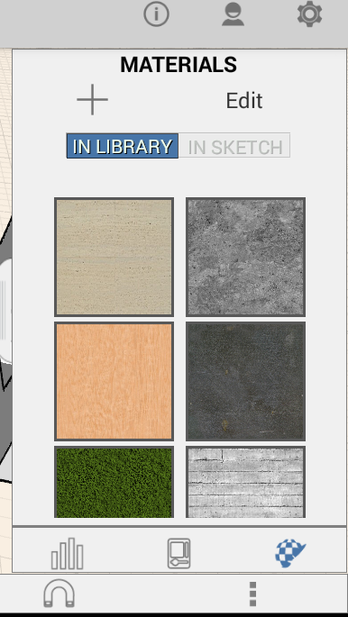

# Create, Edit, and Apply a Material

----

Use the Material Editor to place a material on an object or a selected object face.

Materials can be applied to faces or entire objects.

## Apply a Material

1. To apply a material, first select a face or object.
2. Click the tab on the right side of the screen and click the icon for the Material Editor.
3. Choose a material from the displayed selection, or create your own. 
    
    

## Edit a Material

1. Select a material.
2. Choose the Edit icon.
3. Replace the bitmap or alter the color scheme for the material.

Tablets let you choose between swatches and a color wheel.

1. Select Done.

### Create a Material

1. Select the "+" (plus icon or +Create button).
2. Choose a bitmap to use for the material.

Load an image from a file, or even take a photo with a tablet.

1. Choose a color for the material.
