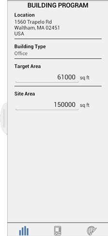

# Building Performance

----

Start a BIM workflow by evaluating the performance of elements from the beginning of the design process.

### Building Performance

| | |
| ---- | ---- |
| The Building Program screen provides an indication of Building Type and Site Area.   |      |

#### See Also

* [Examine Object Properties ](../../Modify Designs/Examine Object Properties.md)
* [Levels and Volume ](../../Levels and Space Usage.md)

  

#### Topics in this section

* [ Sun and Shadow Settings ](../Sun and Shadow Settings.md)
    
    Control the angle of the shadows at your locations by setting date and time.
* [Solar Analysis](../Solar Analysis.md)
    
    Visualize the amount of solar radiation that your model receives.

