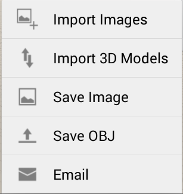
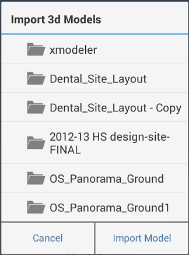

# Import 3D Models and Images

----

Add overlays and images to your designs for a variety of purposes.
 

Images or existing 3D models add additional information to your sketch.

1. Select an image or 3D model from your local or A360 storage area.

You will have the option to scale and crop your image. Your image will then be imported into the canvas.

1. Use the palette on the right-side of the screen to modify image properties.

Edit the image's name and transparency, if needed. Manage the vertical ordering of various ground overlays including any satellite image.

* You can import geometry from your local file system using OBJ or AXM formats. Just tap on the import icon from the toolbar and choose Import 3D Model.
NoteYou can also drag and drop an OBJ or AXM file from your system onto your canvas.