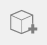

# Place Primitives

----

Use pre-defined shapes as design building blocks.

## Place a Primitive

1. Placing primitives provides a second way to create content.
2. Tap one of the five shapes on the primitives palette and tap in the drawing area.
