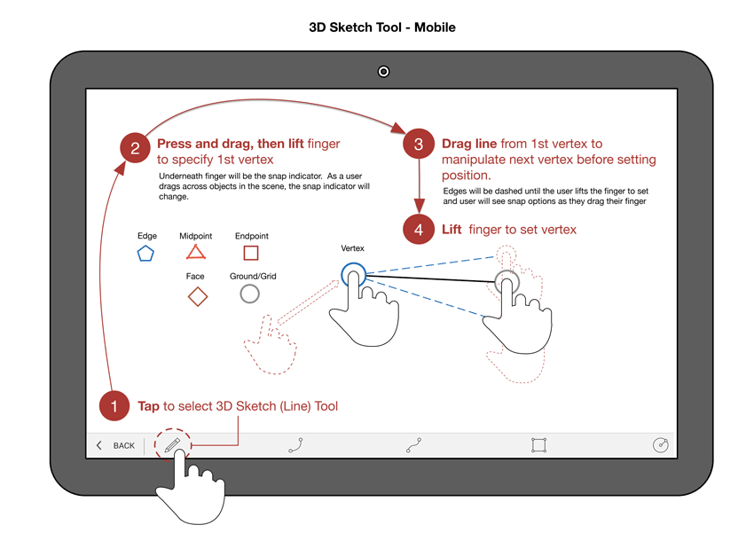
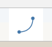
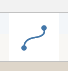
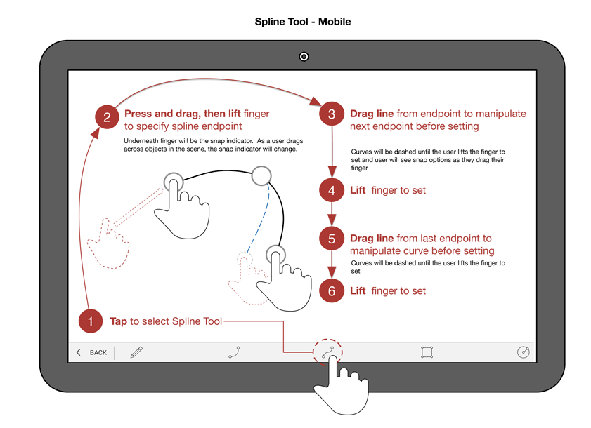
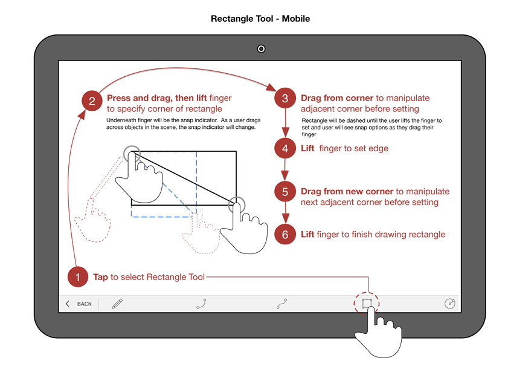

# Sketching Shapes

----

Use Lines, Arcs, Splines, Rectangles, and Circles to create shapes that you can combine into building designs.

After selecting a drawing tool, you can hover anywhere on the canvas to use snaps and inference points before you place your first point.

## Using Lines

1. After selecting the line tool, you can tap anywhere on the canvas and drag your finger to use snaps and inference points. Once you are ready to place the first endpoint of the line, lift your finger. To draw the next line segment, you will need to drag from the last endpoint.

## Using Arcs

 
1. After selecting the arc tool, you can tap anywhere on the canvas and drag your finger to use snaps and inferencing. Once you are ready to place the first endpoint of the arc, lift your finger. To draw the other endpoint of the arc, you will need to drag from the last endpoint. Lastly, grab the midpoint to manipulate the arc angle. 

## Using Splines

 
1. After selecting the spline tool, you can tap anywhere on the canvas and drag your finger to use snaps and inferencing. Once you are ready to place the first endpoint of the spline, lift your finger. To draw the next endpoint, you will need to drag from the last endpoint. 

## Using Rectangles

 
1. After selecting the rectangle tool, you can tap anywhere on the canvas and drag your finger to use snaps and inference points. Once you are ready to place the first endpoint of the rectangle, lift your finger. To draw the sides of the rectangle, you will need to drag from the last endpoint.

## Using Circles

 
1. After selecting the circle tool, you can tap anywhere on the canvas and drag your finger to use snaps and inferencing. Once you are ready to place the midpoint of the rectangle, lift your finger. To specify the radius of the circle, you will need to drag from the midpoint. 
