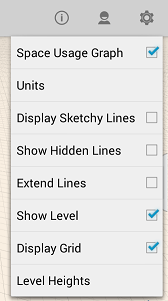
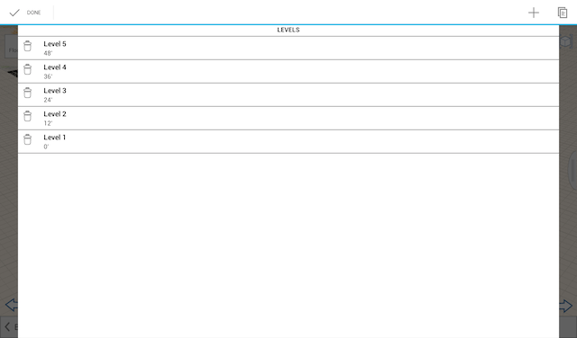
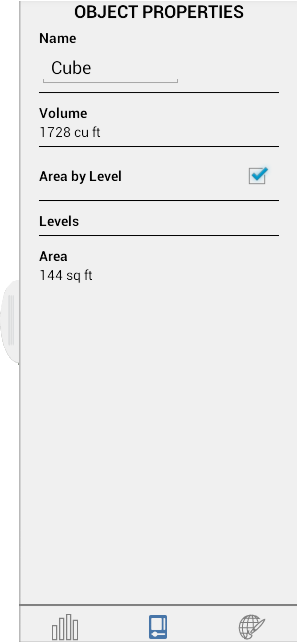

# Levels and Space Usage

----

See area calculations for objects in a design.

## Enable Levels

1. Tap Settings and then toggle Show Level. 
    
    
2. Click Level Heights to add or modify level values. 
    
    

## Properties and Space Usage

Open the right-side palette to the Building Properties tab to view or edit the properties of selected individual objects in a sketch. Under Properties, you can edit the object's name, see its volume/area, or toggle/edit levels.

* Once the Building Area in the top left widgets panel is set, the Gross Area and Floor Area Ratio will automatically update for the entire sketch. To activate this feature and add individual elements to these figures, the Area by Level toggle found under Properties must be enabled on each object. 
    
    
