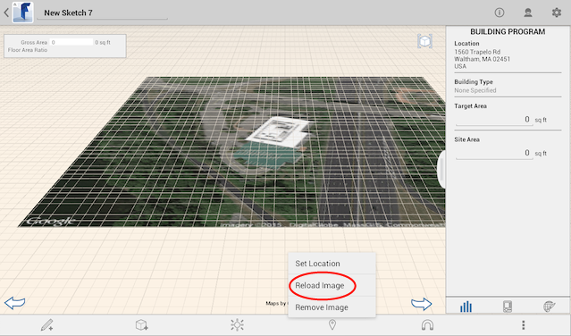
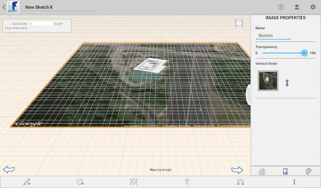

# Edit, Reload, or Remove a Satellite Image

----

Make changes to your location images.

## Working with Satellite Images

1. Reload. 
    
    
2. To remove a satellite image:  
    * Double tap the image, tap Location, and tap Remove Image.
    * Double tap the image, long press to open the Context menu and tap X (delete).
    
    
3. Image Properties: 
    
    Change the image name, its transparency, or its place in the vertical order.
    
    
