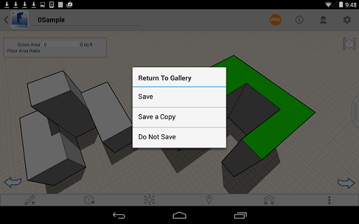

# Saving Your Work

----

Preserve your designs in multiple formats.
 
* All your sketches can be accessed from your device gallery by tapping on the FormIt 360 icon, or on http://360.autodesk.com . Also Tap the FormIt 360 icon to save a sketch. Every time you return to the gallery, you will be prompted to save your sketch. Sign into http://360.autodesk.com to synchronize your files to the cloud. 
    
    

When a sketch is synchronized to http://360.autodesk.com three files are created in AXM, SAT, and RVT formats (the latter for opening in Revit software-based products).  The Revit file can be downloaded locally, and opened directly in Revit.
