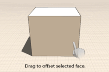

# Modify: Extrude, Cut/Offset Faces

----

Push or pull a face, or imprint new shapes on existing ones, or change create new edges offset from the original ones.

1. To push and pull a face, tap a face then drag with one or two fingers. A one finger drag extrudes the face, and a two-finger drag extrudes the face while retaining the original edges. The face will move back and forth, you can drag to snap and inference points on other model elements. Tap again to finish moving the face.
2. To imprint shapes, use a 3D Sketch tool to draw lines, arcs, splines, rectangles or circles onto existing faces. This action creates new faces that can be pushed / pulled independently of the original face.
3. To offset a face, after face selection, tap on the offset tool from the context menu. Then, drag over the face to create a series of edges offset from the original edges.

  

#### Topics in this section

* [ Modify: Tilt, Array, Copy/Paste](../Modify Tilt, Array, Copy-Paste.md)
    
    Create more complex designs by making alterations to previously drawn shapes.
* [Modify: Boolean Operations](../Modify Boolean Operations.md)
    
    Use Join and Cut operations to alter objects.

