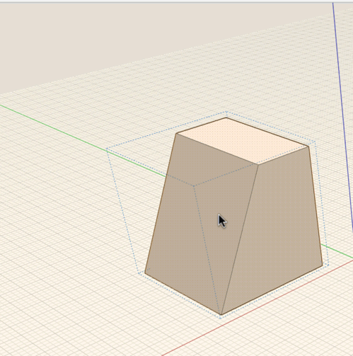

# Group Axes and Work Planes

----
 

Groups have their own axes and [work plane](GUID-8886AB5D-FB16-4562-8CC9-94A5FFC9ED74.htm) distinct from the[ world axes ](GUID-79E461FF-6579-4F8C-8A81-F3B384FBA8B7.htm) in the main sketch. Rotating or moving the axes in a group will only affect the instances of the group.

[Please send us your comment about this page](#)