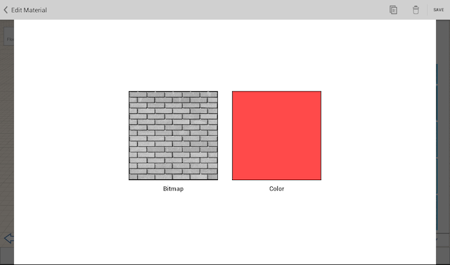

# Using Materials

----

Enrich and enhance designs using Materials to add detail.
 

The Material Editor is located in the right-side palette. In the Editor, you can create new materials and add them to your Material Library. To add color to a material, you can use the color picker to accurately set the tint for the material or select a predefined color swatch.

* Materials allow you to add detail to your sketch. You can apply materials to faces or entire objects using the Material Editor found in the right-side palette. 
    
    

The widgets provided by the Materials Editor allow you to:

* Activate the paintbrush tool
* Edit the color or the bitmap image of a material
* Copy or delete a material

When applied to the sketch, materials will be added to a list of already used materials for easy access. A material can have a texture (bitmap) and/or color. When a material has both texture and color, the two are multiplied together.

* Use the Material Editor to modify or create materials. 
    
    

  

#### Topics in this section

* [Create, Edit, and Apply a Material](../Create, Edit, and Apply a Material.md)
    
    Use the Material Editor to place a material on an object or a selected object face.

