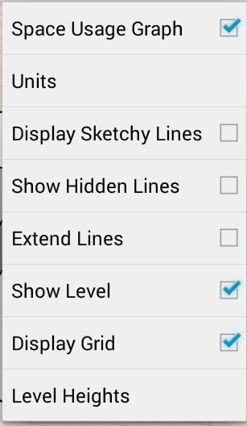

# Visual Format Options

----

Description of choices for visual style.

### Visual Style Options

| | |
| ---- | ---- |
|    |    You can access the Settings menu by tapping on the gear icon from the toolbar. You have several modifiable options:  * Space usage graph: Toggle on/off the statistics display just below drawing name * Units: Specify the sketch's units, Imperial or Metric * Display Sketchy Lines: Toggle to turn sketchy lines on and off. * Show Hidden Lines: Change the appearance of your sketch by toggling features like sketchy lines, hidden lines, or extended lines * Extend Lines: Toggle to see extended lines. * Show Level: See levels * Display Grid: Toggle to turn grid view on and off. * Level Heights: See the heights of levels.   |

