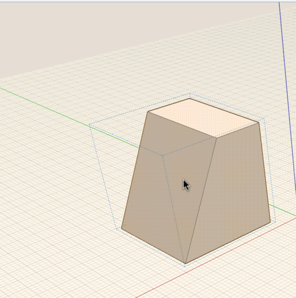

# Group Axes and Work Planes

----
 

Groups have their own axes and [work plane](../../Modify Designs/Work Planes.md) distinct from the[ world axes ](../../Modify Designs/World Axes.md) in the main sketch. Rotating or moving the axes in a group will only affect the instances of the group.

