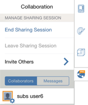

# Start and Stop Collaborative Sessions

----

Invite other people to work on the same design project.

Share your work with others.
NoteFormIt 360 Pro only.
## Starting a Sharing Session

* Tap the Collaboration icon on the far right side of the tool bar. If you are not already logged in, you will be asked to sign in with your [Autodesk 360](https://360.autodesk.com) account. Then, tap Start Sharing Session. 
    
    A dialog will appear for you to invite others. Upon successfully starting a session, you will see an icon with your Autodesk 360 avatar appear on the Collaboration tab.
    
    

## Ending a Session

* Select End Sharing Session from the collaboration tab. 
    
    A guest cannot end a sharing session.
    
    
