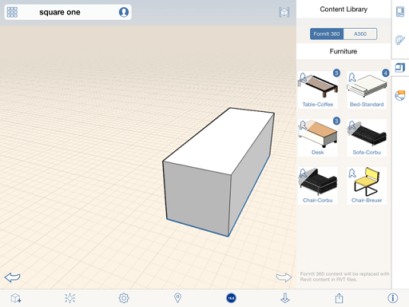

# Content Libraries

----

Use a personal library of frequently used elements like furniture, building elements, or material base files.
 

You can store previous projects and site files. Your content library can be stored and linked to from a local folder (in a Drop Box Sync folder for instance), or an [Autodesk 360 Drive](https://360.autodesk.com). To use a content library, tap the Content Library icon in the properties panel to the right side of the canvas.

After you add new FormIt sketches (.AXM), .OBJ, or .STL files to your content file structure - either locally or on A360 Drive - you will need to refresh the Content Library in FormIt. To do this click the Link Library button again, and either navigate to your local library, or choose the A360 option and FormIt will refresh the list automatically.

If you have linked your library locally, and then start a new FormIt session, you will need to re-link the Content Library. When you click the Content Library tab, you will see a dialog asking permission to link to a local folder. You need to navigate to your top level content library folder.

Content added to a sketch is a group. You can use the group editing tools to make changes to the content.

Inside group edit mode, user can see the content's name and category. You cannot edit the name or category of content converted from Revit families, either local or A360.

You can edit the geometry of placed content, but the changes cannot be migrated back to Revit.

  

#### Topics in this section

* [Link a Content Library](../Link a Content Library.md)
    
    Access previously stored projects and site files.
* [Place Content ](../Place Content.md)
    
    Use the data from a content library file in a design.

