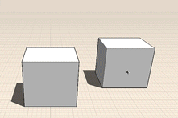

# Modify: Delete, Edit, Move

----

Remove an object, change its location, or modify its properties.

1. To delete geometry, you must first make a geometry selection. Then, long press to see the context menu where you can tap the delete icon.
2. To move edges, faces, or objects, first select, then you are automatically in the move tool. Hover to see snaps and inference points to specify where you want to start your move operation, tap to start. Now hover to see snaps and inference points to the location you want to move the object. Tap again to place the object.
