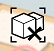

# Group/Ungroup Objects

----

Place geometry into groups to allow easier manipulation, keep objects distinct from one another, and create parent/child relationships between objects

#### Group Objects

1. Tap on the objects you want to group (faces or objects).
2. Press and hold near those objects to display the Context Menu.
3. Tap the Group icon.

#### Ungroup Objects

1. To ungroup an already grouped set of selected objects, tap the Ungroup icon.
