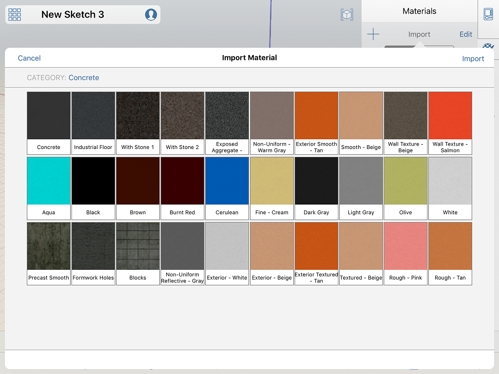

# Create a Material

----

Use the Material Editor to create new materials to use in your scene.

You can create your own materials based on custom bitmap files.

### Create a Material

1. Tap the "+" button in the Material Palette
2. Choose a bitmap to use for the material

Load an image from a file, or even take a photo with a tablet.

1. Choose a color for the material. The color will blend with any bitmap that may have been loaded.

* Textures are imported from your Camera Roll or Photo Library. Once imported, you can edit the texture's mapping using the Material Crop tool. You can crop textures to define the vertical and horizontal tile scale in meters or feet. 
    
    

## Import an Autodesk Material 

If you have purchased the optional [FormIt 360 Pro Subscription](http://www.autodesk.com/products/formit-360/try-buy), you will be able to import materials from the Autodesk Materials library.

1. Tap Import Material from the Material Palette.
2. From the Import Material, browse or search by name to select a material to import into the scene and tap Import.
3. The material can now be applied or [edited](../Edit a Material.md) like any other material.

