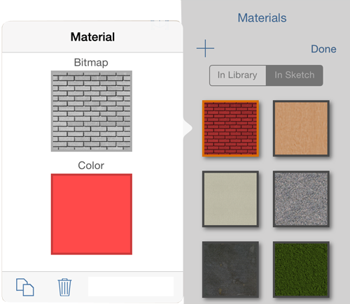

# Edit a Material

----

Use the Material Editor to make materials appear exactly as you want.

The texture, color, and other properties of Materials can be modified in the Material Editor.

## Edit a Material

1. Tap the Edit button in the Material Palette
2. Tap the material you wish to edit

3. 

4. From the Edit Material window, you can change the following properties - which will update the preview image on the right. 
    * *Texture*:Textures are images loaded from your Photo Library or camera. Once imported, you can crop, and edit the horizontal and vertical scale of the texture.
    * *Color*: When a material has both texture and color, the two are multiplied together.
5. Click OK to save the changes to the material.
