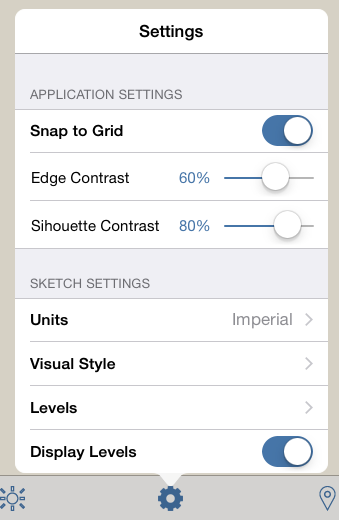

# Visual Format Options

----

Description of choices for visual style.

### Visual Style Options

| | |
| ---- | ---- |
|    |    * *Snap to Grid*: Toggle to turn grid snaps on and off. * *Edge Contrast:* Raise or lower the contrast of how edges are displayed. * *Silhouette Contrast:*Raise or lower the contrast of how silhouette edges are displayed. * *Units*: Specify the sketch's units, Imperial or Metric * *Visual Styles:* Change the appearance of your sketch by toggling features like sketchy lines, hidden lines, or extended lines.      * *Display sketchy lines*: Change the appearance of your sketch by toggling making lines to appear that they have been sketched by hand     * *Show hidden lines*: Display faint lines that are normally hidden by other faces     * **Extend lines*: *Display short extensions where lines intersect     * *Thick edges*: Widest lines possible     * *Hide edges*: Toggle this feature to turn off edges in your model. * *Levels*: Edit Level heights for the entire sketch (see Apply Levels for more details) * *Display Levels: *Toggle the visibility of levels   |
|    |    * *Display Grid:* Toggle the visibility of the grid * *Display axes: *Toggle the visibility of the coordinate system axes * *Display north arrow: *Toggle the visibility of the north arrow * *Show Watertight Issue: *Used for 3D printing to ensure model integrity   |

